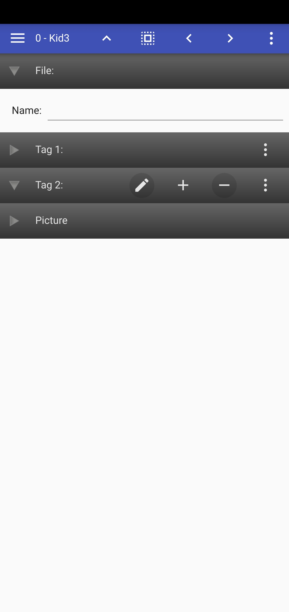
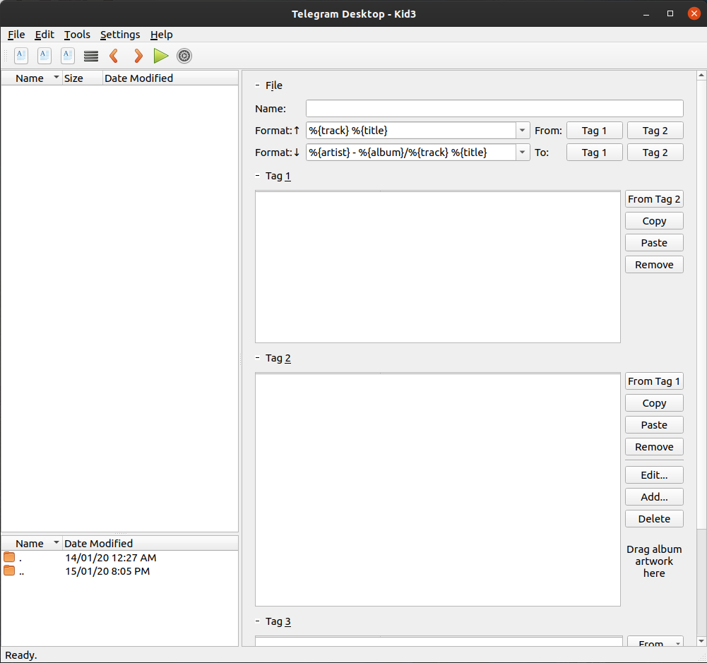

# **Kid3 - Audio Tagger**

---

## Contents
1. TOC
{:toc}

## Introduction

If you want to easily tag multiple MP3, Ogg/Vorbis, FLAC, MPC, MP4/AAC, MP2, Opus, Speex, TrueAudio, WavPack, WMA, WAV and AIFF files (e.g. full albums) without typing the same information again and again and have control over both ID3v1 and ID3v2 tags, then Kid3 is the program you are looking for.

## Features

Kid3
With Kid3 you can:

- Edit ID3v1.1 tags
- Edit all ID3v2.3 and ID3v2.4 frames
- Convert between ID3v1.1, ID3v2.3 and ID3v2.4 tags
- Edit tags in MP3, Ogg/Vorbis, DSF, FLAC, MPC, MP4/AAC, MP2, Opus, Speex, TrueAudio, WavPack, WMA, WAV, AIFF files and tracker modules (MOD, S3M, IT, XM)
- Edit tags of multiple files, e.g. the artist, album, year and genre of all files of an album typically have the same values and can be set together.
- Generate tags from filenames
- Generate tags from the contents of tag fields
- Generate filenames from tags
- Rename and create directories from tags
- Generate playlist files
- Automatically convert upper and lower case and replace strings
- Import from [gnudb.org](http://gnudb.org/), [TrackType.org](http://tracktype.org/), [MusicBrainz](http://musicbrainz.org/), [Discogs](http://discogs.com/), [Amazon](https://www.amazon.com/) and other sources of album data
- Export tags as CSV, HTML, playlists, Kover XML and in other formats
- Edit synchronized lyrics and event timing codes, import and export LRC files
- Automate tasks using QML/JavaScript, D-Bus or the command-line interface

## Requirements

Kid3 runs under Linux ([KDE](https://www.kde.org/) or only Qt), Windows, macOS and Android and uses [Qt](https://www.qt.io/), [id3lib](http://id3lib.sourceforge.net/), [libogg, libvorbis, libvorbisfile](https://www.xiph.org/), [libFLAC++, libFLAC](https://flac.sourceforge.net/), [TagLib](http://taglib.github.io/), [Chromaprint](http://acoustid.org/chromaprint).

## Information

- [English Handbook](https://kid3.sourceforge.io/kid3_en.html)
- [Deutsches Handbuch](https://kid3.sourceforge.io/kid3_de.html)
  <!-- - [Screenshot] -->
- The [Kid3 project page at SourceForge](https://sourceforge.net/projects/kid3/) offers for example Git access, download of all releases and mailing lists.
- The [Kid3 page at kde-apps.org](https://www.kde-apps.org/content/show.php?content=10415) offers the possibility to rate Kid3 and to submit comments.
- The [Kid3 page at Open HUB](https://www.openhub.net/p/kid3) offers code metrics and the possibility to rate Kid3 and to submit comments.

## License

Kid3 is open-source software, licensed under the [GNU General Public License (GPL)](https://www.gnu.org/licenses/licenses.html#GPL).

## Download

- Sourcecode [kid3-3.8.1.tar.gz](https://prdownloads.sourceforge.net/kid3/kid3-3.8.1.tar.gz?download)
- Ubuntu users can add the [PPA for Kid3](https://launchpad.net/~ufleisch/+archive/ubuntu/kid3):
  ```bash
  sudo add-apt-repository ppa:ufleisch/kid3
  sudo apt-get update
  sudo apt-get install kid3     # KDE users
  sudo apt-get install kid3-qt  # without KDE dependencies
  sudo apt-get install kid3-cli # for the command-line interface
  ```
- Linux binaries (64-bit) [kid3-3.8.1-Linux.tgz](https://prdownloads.sourceforge.net/kid3/kid3-3.8.1-Linux.tgz?download)
- Windows binaries (64-bit) [kid3-3.8.1-win32-x64.zip](https://prdownloads.sourceforge.net/kid3/kid3-3.8.1-win32.zip?download) and (32-bit) [kid3-3.8.1-win32.zip](https://prdownloads.sourceforge.net/kid3/kid3-3.8.1-win32.zip?download)
- macOS binaries [kid3-3.8.1-Darwin.dmg](https://prdownloads.sourceforge.net/kid3/kid3-3.8.1-Darwin.dmg?download)
- Android package [kid3-3.8.1-android.apk](https://prdownloads.sourceforge.net/kid3/kid3-3.8.1-android.apk?download)

Special thanks to Marcel Strittmatter for providing hardware that allows the continuation of macOS support!


##### Thanks to all those who created the following packages:

- Windows [Chocolatey Package](https://chocolatey.org/packages/kid3/)
- macOS [Homebrew Package](https://formulae.brew.sh/cask/kid3)
- Android [F-Droid Package](https://f-droid.org/en/packages/net.sourceforge.kid3/)
- Package for [Arch Linux](https://www.archlinux.org/packages/community/x86_64/kid3/) (by Jaroslav Lichtblau)
- Package for [Chakra](https://rsync.chakralinux.org/packages/desktop/x86_64/kid3-3.8.1-1-x86_64.pkg.tar.xz) (by Neophytos Kolokotronis)
- [Overview](https://build.opensuse.org/package/show/multimedia:apps/kid3) of packages for openSUSE
- [kid3](http://packman.links2linux.org/package/kid3) for openSUSE (by Packman)
- [kid3](https://packages.debian.org/sid/kid3) and [kid3-qt](https://packages.debian.org/sid/kid3-qt) for Debian Unstable (by Mark Purcell, Patrick Matthäi)
- [kid3](https://packages.ubuntu.com/focal/kid3) and [kid3-qt](https://packages.ubuntu.com/focal/kid3-qt) for Ubuntu 20.04

##### Old Versions

- KDE 5 package for [KaOS](http://kaosx.tk/packages/index.php?act=search&subdir=apps&searchpattern=kid3)
- [Gentoo Package](https://packages.gentoo.org/package/media-sound/kid3?arches=all) (by Johannes Huber)
- Package for [Mageia](http://madb.mageia.org/package/show/name/kid3/release/cauldron/arch/x86_64) (by daviddavid)
- [kid3](https://www.openmamba.org/distribution/distromatic.html?tag=devel&pkg=kid3.i586) for openmamba (by Marco Bellezza)
- Package for [Alt Linux](http://www.sisyphus.ru/ru/srpm/Sisyphus/kde5-kid3) (by Sergey V Turchin)
- Port for [FreeBSD](https://www.freshports.org/audio/kid3-qt5/) (by Max Brazhnikov)
- [Overview](https://apps.fedoraproject.org/packages/kid3/) of packages for Fedora (by Hedayat Vatankhah)
- Port for [NetBSD](http://pkgsrc.se/audio/kid3) (by Thomas Klausner)
- PCLinuxOS 2010 RPM for [kid3](https://spout.ussg.indiana.edu/linux/pclinuxos/pclinuxos/apt/pclinuxos/64bit/RPMS.kde5/kid3-3.4.5-3pclos2019.x86_64.rpm) and [kid3-qt](https://spout.ussg.indiana.edu/linux/pclinuxos/pclinuxos/apt/pclinuxos/64bit/RPMS.kde5/kid3-qt-3.4.5-3pclos2019.x86_64.rpm)
- [RPM](ftp://ftp5.gwdg.de/pub/linux/mandriva/mandrivalinux/devel/2012/i586/media/contrib/release/kid3-2.0.1-2-mdv2012.0.i586.rpm) and [Source RPM](ftp://ftp5.gwdg.de/pub/linux/mandriva/mandrivalinux/devel/2012/SRPMS/contrib/release/kid3-2.0.1-2.src.rpm) for Mandriva 2012 (by Andrey Bondrov)

### Screenshots

{: height="20%" width="20%"}
{: height="40%" width="40%"}

## Git

To get the source code repository, fetch it using Git

```bash
git clone git://git.code.sf.net/p/kid3/code kid3
mkdir build
cd build
cmake ../kid3
```

Or browse the code in [Kid3 Code](https://sourceforge.net/p/kid3/code/).

Then you can build Kid3 with the usual `cmake` and `make` commands or build an RPM or deb package. The table below summarizes the changes made to the source code in Git.

Development snapshot binaries for Linux, Windows and Mac are available in the [development folder](https://sourceforge.net/projects/kid3/files/kid3/development/).

| Date        |   Changes        |
| ----------- |   -------------- |
| ----------- |   -------------- |
| 23 Dec 2019 |   Version 3.8.1. |

## History

<table id="changelog" style="border-spacing: 0 15px">
<thead>
<tr valign="top">
<th align="left">Date</th>
<th align="left">Release</th>
<th align="left" width="100%">Changes</th>
</tr>
</thead>
<tbody>
<tr valign="top">
<td nowrap="nowrap">23 Dec 2019</td>
<td>3.8.1</td>
<td>This bugfix release solves some problems with the binary packages for Linux and Android. Improvements include information about the number of files in the status bar and about the identifier of RVA2 and UFID frames in the frame table. String replacements are now executed in order and support regular expressions.
</td>
</tr>
<tr valign="top">
<td nowrap="nowrap">24 Aug 2019</td>
<td>3.8.0</td>
<td>The CLI now supports JSON for input and output and is independent of any GUI libraries. Other improvements concern better compatibility with iTunes. The import from tags function can now operate on all selected files and return extracted values to scripts.
</td>
</tr>
<tr valign="top">
<td nowrap="nowrap">18 Mar 2019</td>
<td>3.7.1</td>
<td>This release primarily brings bug fixes and usability improvements. Most new features target the Android version, which now supports a dark theme, a better file selection dialog and more configuration options.
</td>
</tr>
<tr valign="top">
<td nowrap="nowrap">23 Dec 2018</td>
<td>3.7.0</td>
<td>The most important new feature is a playlist editor. Playlist items can be added, removed and reordered. Improvements include editors for the formats to convert between tags and file names and drop down lists with available tag values when multiple files are selected. The new file list fixes problems with updates when directories are renamed.
</td>
</tr>
<tr valign="top">
<td nowrap="nowrap">24 Aug 2018</td>
<td>3.6.2</td>
<td>This bugfix release fixes the use of free form MP4 atoms, import from CSV with DOS line endings, the application icon in KDE wayland sessions and other bugs. The generation of file names from tags is improved by supporting conditional text around a value from the tags, which is only inserted when the corresponding value exists.
</td>
</tr>
<tr valign="top">
<td nowrap="nowrap">23 Apr 2018</td>
<td>3.6.1</td>
<td>This bugfix release improves the speed when saving with a lot of unchanged files in the directory. It fixes wrong parsing of the xid atom when using the Mp4v2Metadata plugin, scrolling to the opened file when using a custom sort order in the file list and avoids changing the file name extension when setting file names from the tags.
</td>
</tr>
<tr valign="top">
<td nowrap="nowrap">18 Mar 2018</td>
<td>3.6.0</td>
<td>Ratings can now be edited using stars with configurable mapping between rating values and the number of stars. New options include a maximum length for file names and showing hidden files. Support for MP4 files is improved by handling more atom types. Bug fixes include renaming of directories with subfolders on Windows and finding frames by their frame ID. The Android app has a fresh look in Material style.
</td>
</tr>
<tr valign="top">
<td nowrap="nowrap">1 Nov 2017</td>
<td>3.5.1</td>
<td>This bugfix release fixes a crash with DSF files having sample rates other than 2822400 or 5644800 Hz. It also brings a few usability improvements.
</td>
</tr>
<tr valign="top">
<td nowrap="nowrap">16 Jun 2017</td>
<td>3.5.0</td>
<td>Besides bug fixes and performance improvements, Kid3 3.5.0 brings new features like marking violations of the ID3v2 standard. It is now possible to assign keyboard shortcuts to user actions. The command line version can access frame fields, multiple frames of the same kind and subsets of frames. It starts faster and can run on systems without UI.
</td>
</tr>
 <tr valign="top">
<td nowrap="nowrap">18 Feb 2017</td>
<td>3.4.5</td>
<td>This bugfix release brings improvements with handling lots of files. File tree expansion and filtering are significantly faster and consume less memory. Folders can be explicitly excluded or included. Importing from MusicBrainz and Discogs has been fixed.
</td>
</tr>
<tr valign="top">
<td nowrap="nowrap">23 Dec 2016</td>
<td>3.4.4</td>
<td>This bugfix release fixes the import of durations when importing from file or clipboard, and building with Chromaprint 1.4. New features include a portable mode storing the configuration file in the application folder, copying of images to the clipboard and an MPRIS D-Bus interface for the audio player on Linux.
</td>
</tr>
<tr valign="top">
<td nowrap="nowrap">1 Nov 2016</td>
<td>3.4.3</td>
<td>Tagging of WAV files is improved by supporting ID3v2.3.0 tags on WAV files and better interoperability with RIFF INFO tags by configuring the track field to be "ITRK" and the RIFF chunk to use a lowercase "id3 " name. The latest iTunes tags for classical music are now supported. Bug fixes solve crashes with FLAC files and support for translated names and the 3rd tag in kid3-cli.
</td>
</tr>
<tr valign="top">
<td nowrap="nowrap">24 Aug 2016</td>
<td>3.4.2</td>
<td>This bugfix release fixes issues with copy pasting of tags with multiple frames of the same type (e.g. multiple artists) and deleting frames in kid3-cli. It adapts to changes of the web services used for fetching lyrics. Usability improvements include complex quick access frames like pictures and selection of the file list filter in the settings.
</td>
</tr>
<tr valign="top">
<td nowrap="nowrap">24 Jun 2016</td>
<td>3.4.1</td>
<td>This bugfix release fixes the wrong marking of ID3v2 Date frames as modified and makes it possible to directly add Date frames with ISO date/time values to files which do not yet have an ID3v2.4.0, M4A or Vorbis tag. For the Windows version, issues with incorrect relative paths in playlists, importing from Discogs and temporary files generated by id3lib were fixed.
</td>
</tr>
<tr valign="top">
<td nowrap="nowrap">23 Apr 2016</td>
<td>3.4.0</td>
<td>It is now possible to edit more than two tags, for example ID3v1, ID3v2 and APE tags of MP3 files or ID3v1, ID3v2 and Vorbis tags of FLAC files. Support for RIFF INFO chunks in WAV files has been added. Bug fixes include the editing of synchronized lyrics on Windows.
</td>
</tr>
<tr valign="top">
<td nowrap="nowrap">10 Mar 2016</td>
<td>3.3.2</td>
<td>This bugfix release adapts the import to changes of the Discogs service. It is now possible to set the encoding used for exported files and playlists. Third-party libraries have been fixed to solve random crashes on Windows and file corruptions when writing WAV files.
</td>
</tr>
<tr valign="top">
<td nowrap="nowrap">4 Feb 2016</td>
<td>3.3.1-1</td>
<td>Minor fix to find kid3qml plugin only for Windows, see <a href="https://sourceforge.net/p/kid3/bugs/124/">bug #124</a>.
</td>
</tr>
<tr valign="top">
<td nowrap="nowrap">17 Dec 2015</td>
<td>3.3.1</td>
<td>Package for Android, support GEOB frames in CLI. Improvements for high pixel density displays and handling read-only files. Bug fixes include selection of text encoding in picture frames, higher resolution application icons and a workaround for cropped pictures on high pixel density displays.
</td>
</tr>
<tr valign="top">
<td nowrap="nowrap">1 Oct 2015</td>
<td>3.3.0</td>
<td>Support audiobook and podcast frames. Configurable order of the quick access frames, a more user friendly naming of the frames, and the possibility to use submenus and separators in the user actions context menu.
</td>
</tr>
<tr valign="top">
<td nowrap="nowrap">12 May 2015</td>
<td>3.2.1</td>
<td>This bug fix release fixes a bug on Mac OS X where the file tree of network shares is not shown correctly, cover art pictures which are displayed too small, single quotes in kid3-cli and packaging issues. Cover art in APE tags is now supported.
</td>
</tr>
 <tr valign="top">
<td nowrap="nowrap">18 Mar 2015</td>
<td>3.2.0</td>
<td>Script interface to write extensions and automate tasks using QML/JavaScript. Example scripts to embed, export and resize album art, export tags and fetch lyrics from a web service. Support for building with KDE 5 and tagging DSF and Ogg/FLAC files. More options to number tracks and marking oversized embedded album art.
</td>
</tr>
<tr valign="top">
<td nowrap="nowrap">9 Nov 2014</td>
<td>3.1.2</td>
<td>This bug fix release offers the possibility to change the permissions when trying to save read-only files. It fixes bugs like editing a frame for multiple files which do not all already have such a frame or the use of special characters in M4A files on Windows. The number of open file descriptors is reduced, which should solve problems when working with a huge number of files. The Discogs import has been updated to address the latest restrictions.
</td>
</tr>
<tr valign="top">
<td nowrap="nowrap">24 Aug 2014</td>
<td>3.1.1</td>
<td>This bug fix release fixes incorrect behavior when removing custom frames (COMM, PRIV, TXXX, free form), setting of POPM frames using kid3-cli, import of composer from MusicBrainz and other smaller issues, as well as platform-specific bugs such as kid3-cli output redirection on Windows, support for case-sensitive filesystems on OS X and drag'n'drop on OS X 10.10.
</td>
</tr>
<tr valign="top">
<td nowrap="nowrap">23 Apr 2014</td>
<td>3.1</td>
<td>Support for synchronized lyrics and event timing codes, find and replace strings in tags and file names, details and sort columns in file list, bug fixes and usability improvements.
</td>
</tr>
<tr valign="top">
<td nowrap="nowrap">29 Nov 2013</td>
<td>3.0.2</td>
<td>This bugfix release solves the problem that translations and the documentation were not found on Mac OS X 10.9 Mavericks. The application is now correctly terminated when the main window is closed while the handbook is open. Session restoration and the genres list have been improved. A few build system issues are fixed too.
</td>
</tr>
<tr valign="top">
<td nowrap="nowrap">29 Oct 2013</td>
<td>3.0.1</td>
<td>This is a bug fix release for 3.0. It fixes the incorrect configuration conversion and toolbar configuration in the KDE version, the filename format configuration, bugs in the fingerprint import and several build issues for different Linux distributions.
</td>
</tr>
<tr valign="top">
<td nowrap="nowrap">23 Oct 2013</td>
<td>3.0</td>
<td>Flexible architecture with common shared libraries and plugins for metadata libraries and importers, new command-line application, support for Opus format, bug fixes and usability improvements.
</td>
</tr>
<tr valign="top">
<td nowrap="nowrap">10 Mar 2013</td>
<td>2.3</td>
<td>Automatic batch import for multiple directories, improved import, configurable quick access tag frames, better responsiveness when working with a huge number of files, long operations can be aborted, bug fixes and usability improvements.
</td>
</tr>
<tr valign="top">
<td nowrap="nowrap">03 Dec 2012</td>
<td>2.2.1</td>
<td>This is a bug fix release for 2.2. It fixes the selection of a wrong language if the primary language is not supported and the first fallback language should be English and that the English instead of the German handbook was displayed for a German locale.
</td>
</tr>
<tr valign="top">
<td nowrap="nowrap">26 Oct 2012</td>
<td>2.2</td>
<td>Improved Discogs and AcoustID audio fingerprint import, bug fixes and usability improvements.
</td>
</tr>
<tr valign="top">
<td nowrap="nowrap">12 May 2012</td>
<td>2.1</td>
<td>Chromaprint Acoustid fingerprint import, keyboard shortcuts, improved
iTunes support, icons, bug fixes.
</td>
</tr>
<tr valign="top">
<td nowrap="nowrap">02 Nov 2011</td>
<td>2.0.1</td>
<td>Minor bugfixes. The build system is also improved and should work out of
the box on most distributions.
</td>
</tr>
<tr valign="top">
<td nowrap="nowrap">05 Sep 2011</td>
<td>2.0</td>
<td>Extract and move information between tags, many improvements and
refactorings, e.g. in file list, import, numbering tracks, renaming directories,
GUI and usability.
</td>
</tr>
<tr valign="top">
<td nowrap="nowrap">05 Feb 2011</td>
<td>1.6</td>
<td>Improved numbering of tracks, GUI and usability.
</td>
</tr>
<tr valign="top">
<td nowrap="nowrap">26 Sep 2010</td>
<td>1.5</td>
<td>Faster filtering, simple audio player, GUI and usability improvements.
</td>
</tr>
<tr valign="top">
<td nowrap="nowrap">06 Mar 2010</td>
<td>1.4</td>
<td>Support for Ogg cover art, import from Amazon, usability improvements.
</td>
</tr>
<tr valign="top">
<td nowrap="nowrap">30 Oct 2009</td>
<td>1.3</td>
<td>Support for WMA/ASF, AIFF and WAV files, advanced playlist creation,
improved tag editing.
</td>
</tr>
<tr valign="top">
<td nowrap="nowrap">25 Apr 2009</td>
<td>1.2</td>
<td>Import of album cover art, options to mark changed tag fields and to store
the ID3v2 genre as text instead of numeric string.
</td>
</tr>
<tr valign="top">
<td nowrap="nowrap">25 Oct 2008</td>
<td>1.1</td>
<td>All tags (not only artist, album, ...) can be used for all operations
(e.g. import, export, tag &lt;-&gt; file name, rename, ...), additional tags can be
imported from Discogs and MusicBrainz, setting character encoding for
ID3v1.1 tags.
</td>
</tr>
<tr valign="top">
<td nowrap="nowrap">3 Apr 2008</td>
<td>1.0</td>
<td>File filter, D-Bus interface, FLAC picture support, rename directory wizard,
usability improvements.
</td>
</tr>
<tr valign="top">
<td nowrap="nowrap">2 Dec 2007</td>
<td>0.10</td>
<td>Direct editing of all frames.
Support for MP4/AAC, MP2, Speex, TrueAudio and WavPack files.
Usability improvements.
Support build with KDE 4.
</td>
</tr>
<tr valign="top">
<td nowrap="nowrap">12 Jun 2007</td>
<td>0.9</td>
<td>Hierarchical directory tree, enhanced context menu commands, editor for
custom genres, mark truncated ID3v1.1 fields, import from gnudb.org and
TrackType.org, usability improvements.</td>
</tr>
<tr valign="top">
<td nowrap="nowrap">22 Nov 2006</td>
<td>0.8.1</td>
<td>Fixed bug: A new Custom genre was added on termination.</td>
</tr>
<tr valign="top">
<td nowrap="nowrap">21 Nov 2006</td>
<td>0.8</td>
<td>Import from freedb2.org, Discogs and MusicBrainz release database.
Support for ID3v2.4 and MPC using TagLib.
Support build with Qt4 and tunepimp 0.5.x.</td>
</tr>
<tr valign="top">
<td nowrap="nowrap">28 Jun 2006</td>
<td>0.7</td>
<td>Export, show/hide ID3v1.1/ID3v2.3, custom genres, automatic track
numbering, improved import (search history, track reordering), split filename
and tag format into separate options and commands, builds with libtunepimp 0.4.x.</td>
</tr>
<tr valign="top">
<td nowrap="nowrap">31 Oct 2005</td>
<td>0.6</td>
<td>Support for Ogg/Vorbis and FLAC files, import from MusicBrainz, usability
improvements.</td>
</tr>
<tr valign="top">
<td nowrap="nowrap">31 Jul 2004</td>
<td>0.5</td>
<td>Length and count check on import, shortcut configuration, rename and
create directories from tags.</td>
</tr>
<tr valign="top">
<td nowrap="nowrap">24 Jan 2004</td>
<td>0.4</td>
<td>Direct import from freedb.org. Minor GUI changes.</td>
</tr>
<tr valign="top">
<td nowrap="nowrap">21 Oct 2003</td>
<td>0.3</td>
<td>Automatic case conversion and string replacements.
Import of album data from freedb.org and other sources.
Improved Windows version: persisted configuration, online help.</td>
</tr>
<tr valign="top">
<td nowrap="nowrap">14 May 2003</td>
<td>0.2.1</td>
<td>Use automake/autoconf to build, no change on code.</td>
</tr>
<tr valign="top">
<td nowrap="nowrap">28 Apr 2003</td>
<td>0.2</td>
<td>Placed controls in a scrollview, so that window can
be resized. Show busy cursor while reading and writing files.</td>
</tr>
<tr valign="top">
<td nowrap="nowrap">12 Jan 2003</td>
<td>0.1</td>
<td>First release at SourceForge</td>
</tr>
</tbody>
</table>
{::options parse_block_html="true" /}

## Support

- If you found a bug, create a [bug report](https://sourceforge.net/p/kid3/bugs/).
- If you need a feature, create a feature request.
- Ask for help in the [forum](https://sourceforge.net/p/kid3/discussion/).
- Contact the author: Urs Fleisch [`<ufleisch at users.sourceforge.net>`](ufleisch%20at%20users.sourceforge.net).
